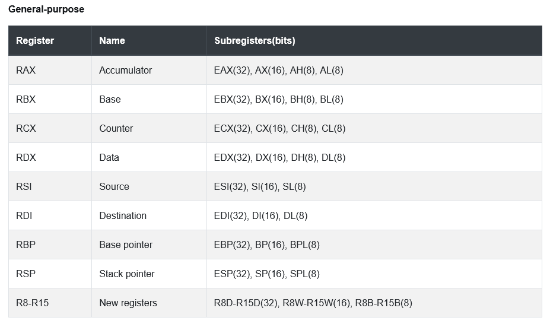

## Some useful doc

Register used for function argument : rdi, rsi, rdx, rcx, r8, r9
The first 6 integer/pointer arguments are passed in:
RDI, RSI, RDX, RCX, R8, R9.
Additional arguments are passed on the stack.
</br>


## When you create a new stack frame

After the call of a new function your stack looks like:

```
Low
|                              |
|    return address in main    |<- RSP
|             main             |<- RBP
High
```

Then you push the old RBP (from the previous stack frame)

```
Low
|                              |
|           Old RBP            |<- RSP
|        return address        |
|             main             |<- RBP
High
```

and you mov the RSP in RBP:

```
Low
|                              |
|           Old RBP            |<- RBP and RSP
|        return address        |
|             main             |
High
```

When you add local variable :

```
Low
| my local var of the new func |<- RSP
|           Old RBP            |<- RBP
|        return address        |
|             main             |
High
```

When exiting the function you put the RSP where It was at the start (on RBP)

```
Low
| my local var of the new func |
|           Old RBP            |<- RBP and RSP
|        return address        |
|             main             |
High
```

And you pop the value contained in RSP and put it in the RBP register

```
Low
| my local var of the new func |
|           Old RBP            |
|        return address        |<- RSP
|             main             |<- RBP
High
```
